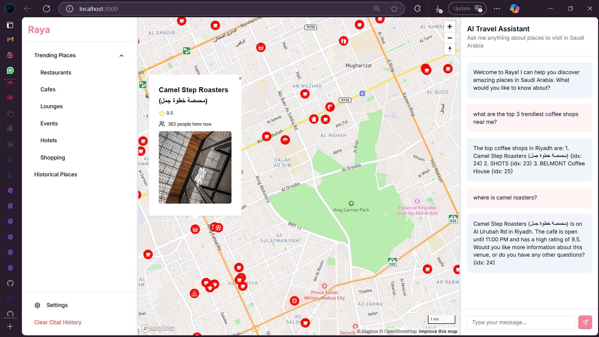

# raya
This project was built in under 5 hours for a uni contest with the help of claude and v0.




# Requirements
you have to have:
- a foursquare api.
- an llm service provider of your choice.
- a telegram bot token for logging.

the `/.cache` folder contains real data entries I gathered for Riyadh when I was developing the app.


# Run
### run nextjs app
```
bun run dev
```

### run python server
set up a venv
```
uv venv
uv pip install -r requirements.txt
```
then run the server
```
uv run app.py
```

## Note
don't use hardcoded credentials that were saved in git's history or those saved in the .env file that i didn't gitignored for absolutely no reason. i have a family i can't afford paying megacorps money.


### License
your driver license or whatever